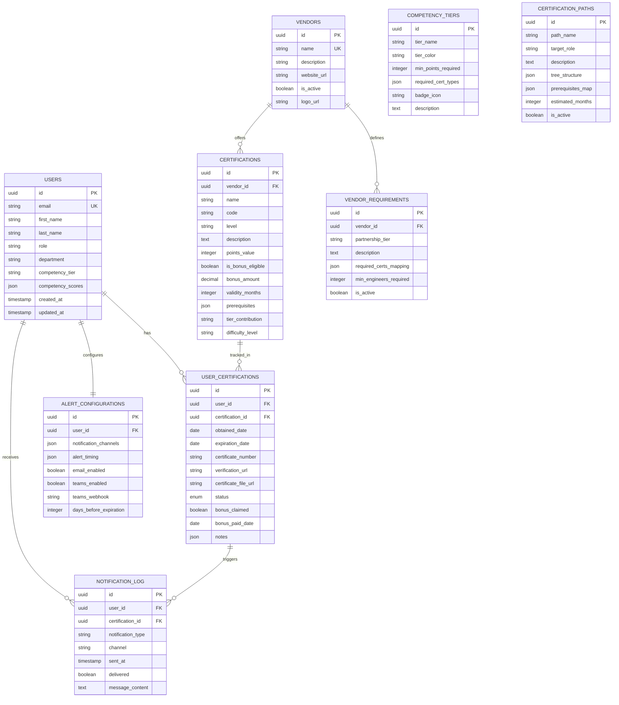
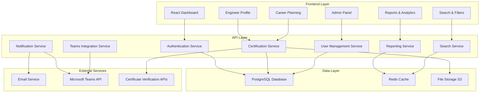
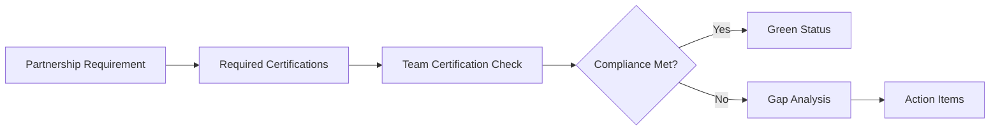
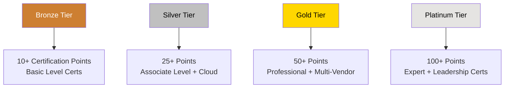
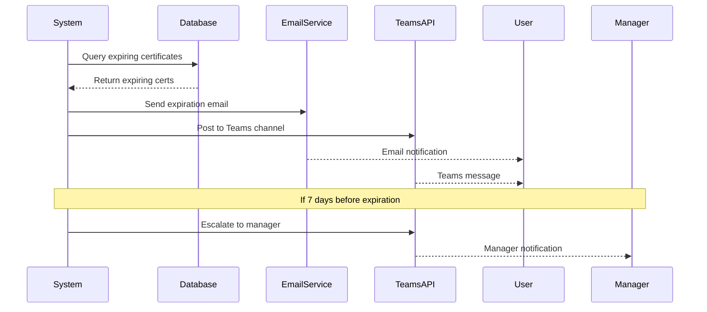
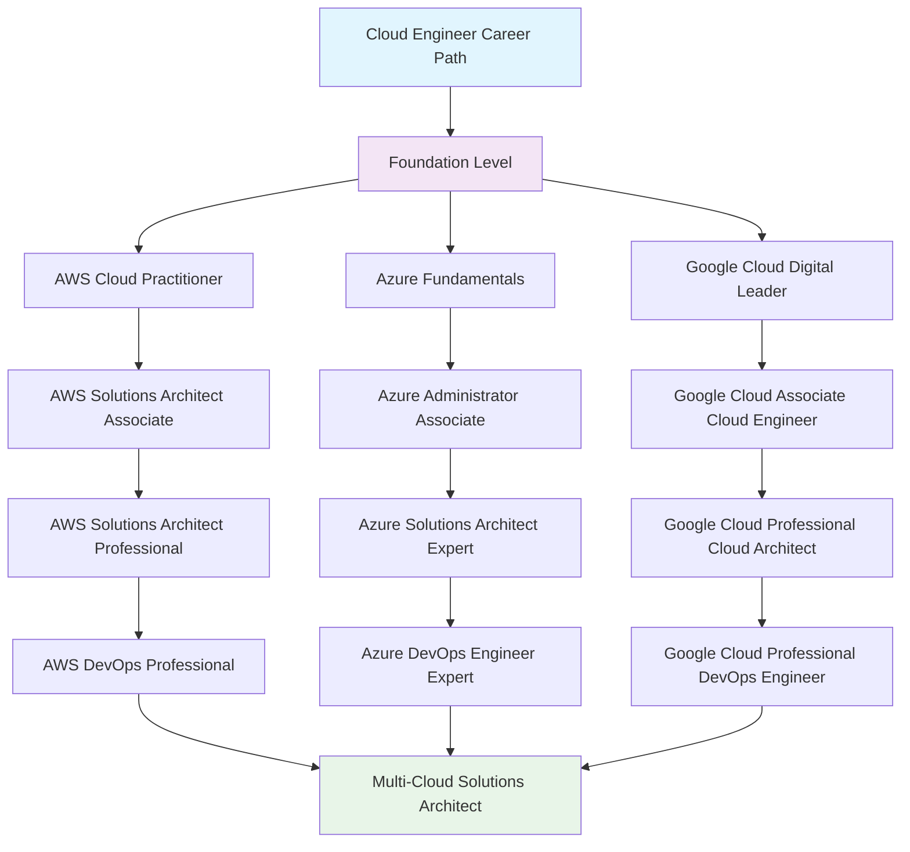
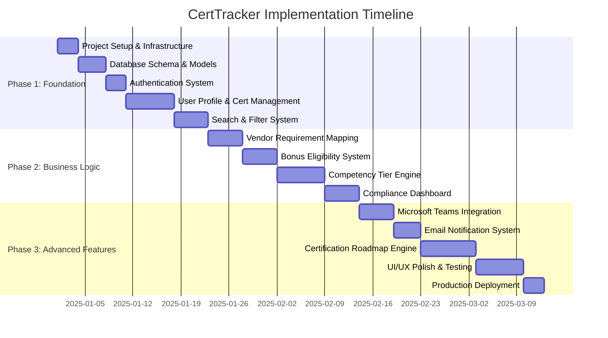
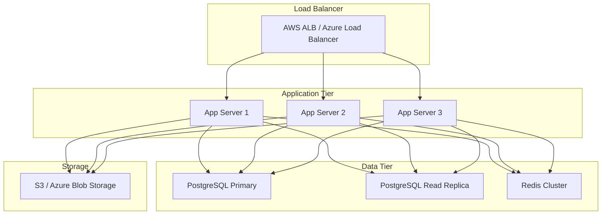

# CertTracker - Certification Management System Architecture Plan

## Executive Summary

CertTracker is a comprehensive web application designed to solve critical certification management challenges for a medium-sized engineering team (20-100 engineers). The system addresses certification visibility, vendor partnership compliance, expiration tracking, bonus management, competency assessment, and career planning.

## Business Problem Statement

### Current Challenges
- **No Centralized Certification Visibility**: Cannot efficiently identify engineers with specific certifications for project staffing
- **Vendor Requirement Compliance Challenges**: Difficulty mapping team certifications against vendor partnership requirements
- **Manual Expiration Tracking**: Certifications expire unnoticed, causing compliance issues
- **Inconsistent Bonus Implementation**: Lack of systematic tracking for certification bonus programs
- **Unclear Competency Measurement**: No defined thresholds for objective competency assessment
- **Career Progression Obstacles**: Engineers lack visibility into certification paths aligned with career goals

### Success Metrics
- 100% of team certifications tracked within 30 days
- Reduce expired certifications by 90%
- Maintain 100% vendor partnership requirements compliance
- Automate 100% of bonus-eligible certification tracking
- 80% of engineers actively using career planning features

## Technology Stack

### Frontend
- **React** with TypeScript for type safety and better developer experience
- **React Query** for efficient data fetching and caching
- **Material-UI** or **Ant Design** for rich UI components
- **D3.js** for tree visualization of certification paths
- **React Virtual** for efficient large data rendering

### Backend
- **Node.js** with Express.js and TypeScript
- **PostgreSQL** for robust data relationships and reporting capabilities
- **Redis** for caching search results and session management
- **Bull Queue** for background job processing (alerts, reports)

### Authentication & Security
- **JWT-based authentication** with refresh tokens
- **Role-based access control** (Engineer, Manager, Admin)
- **Data encryption** for sensitive certification information
- **Audit logging** for compliance tracking

### Integrations
- **Microsoft Teams API** for team notifications
- **SendGrid/AWS SES** for email delivery
- **AWS S3** for certificate file storage
- **Webhook support** for external system integration

## Database Schema Design



## System Architecture



## Priority Features Implementation Plan

### Phase 1: Core Foundation (Weeks 1-3)

#### 1. User Profiles with Certifications
**Features:**
- Complete user registration and authentication system
- Engineer profile management with personal information
- Certification CRUD operations with full lifecycle tracking
- File upload system for certificate documents
- Status indicators (Active, Expiring Soon, Expired, Inactive)
- Certification history and timeline view

**Technical Implementation:**
- JWT-based authentication with role management
- Multer/S3 integration for file uploads
- Automated status calculation based on expiration dates
- Audit trail for all certification changes

#### 2. Advanced Search & Filter System
**Features:**
- Real-time search across certifications, engineers, and vendors
- Multi-criteria filtering system
- Saved search preferences
- Export filtered results

**Search Capabilities:**
```javascript
const searchFilters = {
  text: "AWS Solutions Architect",
  vendors: ["AWS", "Microsoft", "Google"],
  levels: ["Associate", "Professional", "Expert"],
  expirationRange: {
    from: "2024-01-01",
    to: "2024-12-31"
  },
  competencyTiers: ["Bronze", "Silver", "Gold"],
  bonusEligible: true,
  status: ["Active", "Expiring"],
  departments: ["Cloud", "Security", "DevOps"]
}
```

### Phase 2: Business Logic Core (Weeks 4-6)

#### 3. Cert-to-Vendor Requirement Mapping
**Features:**
- Vendor partnership requirement definition system
- Automated compliance gap analysis
- Real-time compliance dashboard
- Partnership tier tracking
- Compliance reporting with actionable insights

**Mapping Logic:**


#### 4. Bonus Eligibility System
**Features:**
- Certification tagging for bonus programs
- Automated bonus calculation engine
- Historical bonus tracking and reporting
- Approval workflow for bonus claims
- Integration with HR/Finance systems

**Bonus Workflow:**
- Automatic detection of bonus-eligible certifications
- Notification to employee and manager
- Approval process tracking
- Payment status monitoring

#### 5. Competency Tier Logic with Visual Labels
**Features:**
- Dynamic competency tier calculation
- Visual badge system with color coding
- Skills matrix visualization
- Tier progression tracking
- Competency-based project staffing recommendations

**Tier Structure:**


### Phase 3: Advanced Features (Weeks 7-9)

#### 6. Multi-Channel Expiration Alert System
**Features:**
- Configurable alert timing (30/60/90 days before expiration)
- Microsoft Teams integration with rich notifications
- Email notifications with action links
- Escalation workflows for management
- Bulk alert processing and delivery tracking

**Microsoft Teams Integration:**


**Teams Message Format:**
- Rich adaptive cards with certification details
- Action buttons for renewal links
- Progress tracking for renewal process
- Team-wide visibility of certification status

#### 7. Tree-Based Certification Roadmap Engine
**Features:**
- Interactive certification path visualization
- Prerequisites and dependency tracking
- Personalized roadmap recommendations
- Progress tracking with milestones
- Estimated timeline and cost calculations

**Roadmap Visualization:**


## Implementation Timeline

### Detailed Phase Breakdown



## User Experience Design

### Dashboard Layout
```
┌─────────────────────────────────────────────────────────────┐
│ CertTracker Dashboard                    [Search] [Profile] │
├─────────────────────────────────────────────────────────────┤
│ Quick Stats                                                 │
│ [🎯 Active: 23] [⚠️ Expiring: 5] [❌ Expired: 2] [💰 Bonus: 3] │
├─────────────────────────────────────────────────────────────┤
│ My Certifications              │ Team Overview              │
│ ┌─────────────────────────────┐ │ ┌─────────────────────────┐ │
│ │ AWS Solutions Architect     │ │ │ Partnership Compliance  │ │
│ │ [🥇 Professional]           │ │ │ AWS: ✅ 15/12 required   │ │
│ │ Expires: 2024-12-15        │ │ │ Azure: ⚠️ 8/10 required  │ │
│ │ [Renew] [Details]          │ │ │ GCP: ❌ 3/8 required     │ │
│ └─────────────────────────────┘ │ └─────────────────────────┘ │
├─────────────────────────────────────────────────────────────┤
│ Career Path Progress                                        │
│ Cloud Architect Path: ████████░░ 80% Complete              │
│ Next: AWS DevOps Professional (Est. 3 months)              │
└─────────────────────────────────────────────────────────────┘
```

### Search Interface
- **Instant search** with typeahead suggestions
- **Filter panels** with collapsible sections
- **Result highlighting** for search terms
- **Sorting options** by relevance, date, level
- **Saved searches** for common queries

### Teams Integration Examples

**Expiration Alert:**
```
🚨 Certification Expiring Soon

John Smith's AWS Solutions Architect Associate expires in 15 days!
📅 Expiration Date: March 30, 2024
🎯 Renewal Link: [Renew Now]
📊 Impact: Required for Project Alpha

[Remind Later] [Mark as Renewed] [View Details]
```

**New Certification Achievement:**
```
🎉 New Certification Earned!

Sarah Johnson just achieved Microsoft Azure Administrator Associate!
🏆 Level: Associate
💰 Bonus Eligible: $500
📈 Team Competency: +5 points

[View Certificate] [Process Bonus] [Update Projects]
```

## Security & Compliance

### Data Protection
- **Encryption at rest** for all sensitive data
- **TLS 1.3** for data in transit
- **Regular security audits** and penetration testing
- **GDPR compliance** for personal data handling

### Access Control
- **Role-based permissions** with granular controls
- **Multi-factor authentication** for admin accounts
- **Session management** with automatic timeout
- **Audit logging** for all data modifications

### Backup & Recovery
- **Automated daily backups** with point-in-time recovery
- **Cross-region replication** for disaster recovery
- **Regular restore testing** to ensure data integrity
- **99.9% uptime SLA** commitment

## Deployment Architecture

### Production Environment


### Monitoring & Observability
- **Application Performance Monitoring** (APM)
- **Real-time error tracking** and alerting
- **Custom dashboards** for business metrics
- **Log aggregation** and analysis
- **Uptime monitoring** with health checks

## Future Enhancements

### Phase 4: Advanced Analytics (Months 4-6)
- **Predictive analytics** for certification trends
- **ROI analysis** for certification investments
- **Skills gap analysis** with market data
- **Automated project staffing** recommendations

### Phase 5: External Integrations (Months 6-9)
- **Learning Management System** integration
- **HR Information System** synchronization
- **Project management tool** connections
- **Certification provider APIs** for automatic updates

### Phase 6: Mobile & Advanced Features (Months 9-12)
- **Mobile application** for iOS and Android
- **Offline capabilities** for remote workers
- **Advanced reporting** with custom dashboards
- **Machine learning** for personalized recommendations

## Cost Estimation

### Development Costs (9-month timeline)
- **Frontend Development**: 320 hours @ $100/hr = $32,000
- **Backend Development**: 400 hours @ $120/hr = $48,000
- **Database Design & Optimization**: 80 hours @ $130/hr = $10,400
- **DevOps & Deployment**: 120 hours @ $110/hr = $13,200
- **Testing & QA**: 160 hours @ $80/hr = $12,800
- **Project Management**: 200 hours @ $90/hr = $18,000

**Total Development Cost**: $134,400

### Infrastructure Costs (Annual)
- **Cloud hosting** (AWS/Azure): $3,600/year
- **Database hosting**: $2,400/year
- **Email service**: $600/year
- **File storage**: $480/year
- **Monitoring & logging**: $1,200/year
- **SSL certificates & security**: $800/year

**Total Annual Infrastructure**: $9,080

### ROI Calculation
- **Prevented certification lapses**: $50,000/year (estimated cost of rushing renewals)
- **Improved project staffing**: $75,000/year (better resource allocation)
- **Automated bonus tracking**: $15,000/year (reduced administrative overhead)
- **Enhanced partnership compliance**: $100,000/year (avoided partnership penalties)

**Total Annual Benefits**: $240,000
**ROI**: 268% in first year

## Conclusion

CertTracker represents a comprehensive solution to address all critical certification management challenges. The prioritized implementation approach ensures rapid value delivery while building toward a robust, scalable platform that will serve the organization's needs for years to come.

The focus on user experience, automation, and integration with existing tools (Microsoft Teams, email) ensures high adoption rates and immediate business impact. The phased approach allows for iterative feedback and continuous improvement throughout the development process.

---

*This architecture plan serves as the foundation for developing CertTracker. Regular reviews and updates will ensure the system continues to meet evolving business needs and technical requirements.*