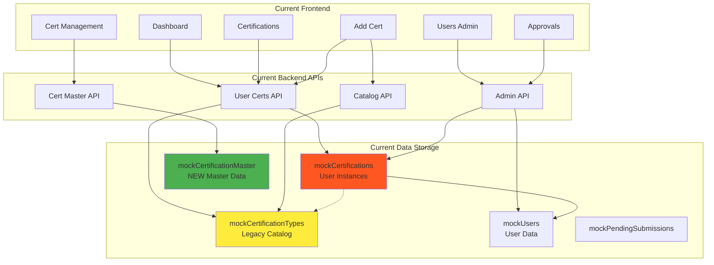
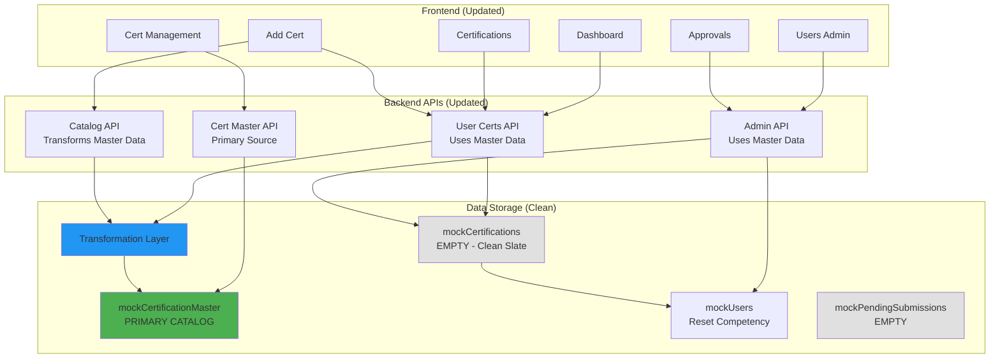
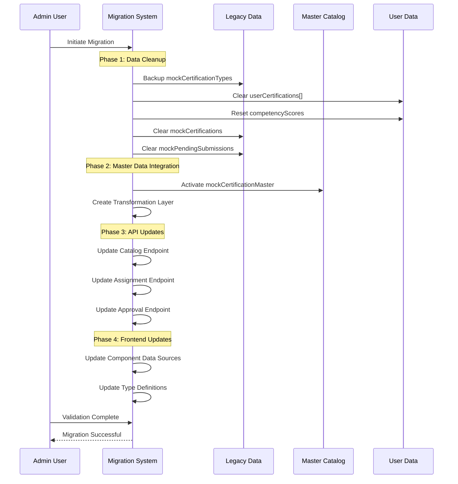
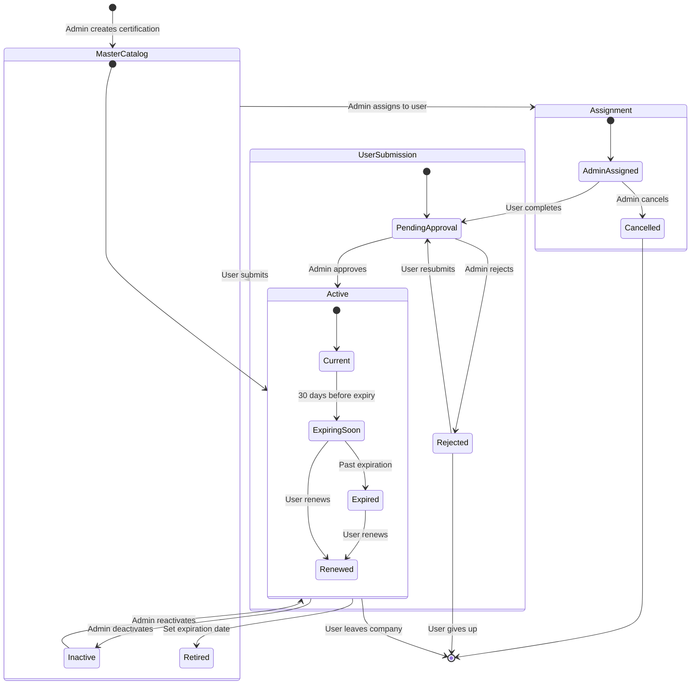
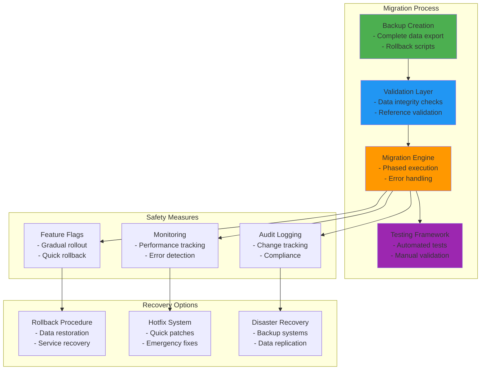
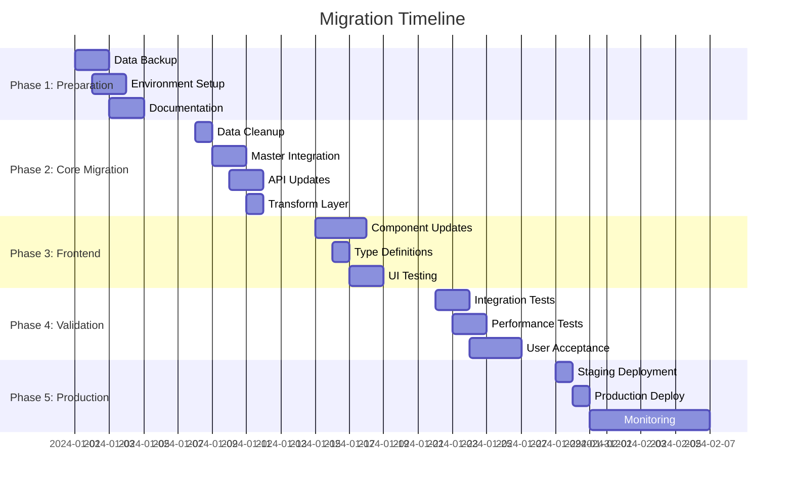
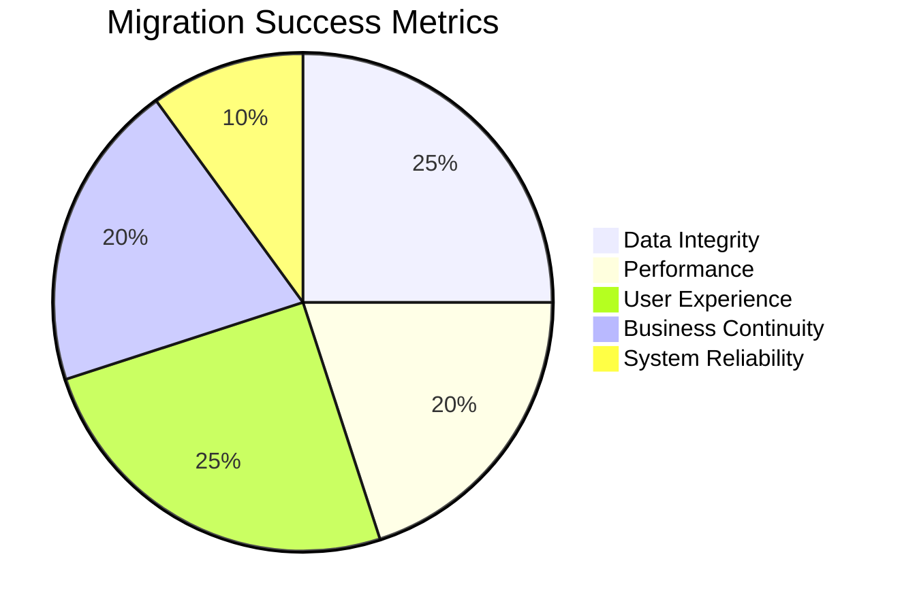

# Migration Architecture Diagrams

## Current System Architecture



## Target System Architecture (Post-Migration)



## Migration Data Flow



## Certification Lifecycle (Post-Migration)



## Data Transformation Architecture

```mermaid
graph LR
    subgraph "Master Data Structure"
        MCM[CertificationMaster<br/>- id<br/>- fullName<br/>- shortName<br/>- version<br/>- vendor: string<br/>- level<br/>- pointsValue<br/>- validityMonths<br/>- isActive]
    end
    
    subgraph "Transformation Layer"
        TF[Transform Function<br/>- Map fullName → name<br/>- Create vendor object<br/>- Calculate bonus eligibility<br/>- Apply business rules]
    end
    
    subgraph "Legacy Format"
        LF[Legacy Format<br/>- id<br/>- name<br/>- vendor: {name}<br/>- level<br/>- pointsValue<br/>- isBonusEligible<br/>- validityMonths<br/>- description]
    end
    
    subgraph "User Certification"
        UC[UserCertification<br/>- id<br/>- userId<br/>- certification: LegacyFormat<br/>- obtainedDate<br/>- expirationDate<br/>- status<br/>- assignment details]
    end
    
    MCM --> TF
    TF --> LF
    LF --> UC
    
    style MCM fill:#4caf50
    style TF fill:#2196f3
    style LF fill:#ff9800
    style UC fill:#9c27b0
```

## Integration Points Mapping

```mermaid
graph TB
    subgraph "Frontend Components"
        subgraph "User Interfaces"
            DU[Dashboard<br/>- Assigned certs display<br/>- Progress tracking]
            CU[Certifications<br/>- Status filtering<br/>- Assignment details]
            AU[Add Certification<br/>- Master catalog search<br/>- Deduplication logic]
        end
        
        subgraph "Admin Interfaces"
            UA[Users Admin<br/>- Assignment workflow<br/>- Cert management]
            APA[Approvals<br/>- Pending reviews<br/>- Master data validation]
            CMA[Cert Management<br/>- Master CRUD<br/>- Lifecycle management]
        end
    end
    
    subgraph "Backend Endpoints"
        subgraph "User APIs"
            UCAPI[GET/POST /certifications<br/>- User cert instances<br/>- Submission workflow]
            CAAPI[GET /certifications/catalog<br/>- Master data transform<br/>- Active filter]
        end
        
        subgraph "Admin APIs"
            AAAPI[/users/:id/assign-certification<br/>- Master data lookup<br/>- Assignment creation]
            APAPI[/admin/certifications/:id/status<br/>- Approval workflow<br/>- Master validation]
            CMAPI[/admin/certifications<br/>- Master CRUD<br/>- Direct access]
        end
    end
    
    subgraph "Data Layer"
        MCM2[Master Catalog<br/>mockCertificationMaster]
        MC2[User Instances<br/>mockCertifications]
        TL2[Transformation<br/>Business Logic]
    end
    
    DU --> UCAPI
    CU --> UCAPI
    AU --> CAAPI
    AU --> UCAPI
    
    UA --> AAAPI
    APA --> APAPI
    CMA --> CMAPI
    
    UCAPI --> MC2
    UCAPI --> TL2
    CAAPI --> TL2
    AAAPI --> TL2
    APAPI --> MC2
    APAPI --> TL2
    CMAPI --> MCM2
    
    TL2 --> MCM2
    MC2 -.-> MCM2
    
    style MCM2 fill:#4caf50
    style TL2 fill:#2196f3
    style MC2 fill:#ff9800
```

## Risk Mitigation Architecture



## Deployment Strategy



## Success Metrics Dashboard



## Post-Migration Architecture Benefits

```mermaid
mindmap
  root((Post-Migration Benefits))
    Data Quality
      Single Source of Truth
      Consistent Validation
      Improved Accuracy
    Admin Efficiency
      Centralized Management
      Bulk Operations
      Lifecycle Control
    User Experience
      Faster Search
      Better Deduplication
      Clearer Status
    System Performance
      Optimized Queries
      Reduced Redundancy
      Better Caching
    Future Scalability
      Modular Architecture
      API Consistency
      Extension Points